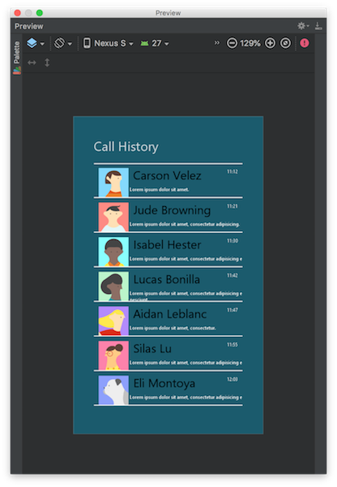
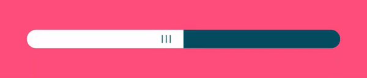

# Styled Views

A collections of styled views.

## Styled RecyclerView

  

The RecyclerView supports [addItemDecoration](https://developer.android.com/reference/android/support/v7/widget/RecyclerView#addItemDecoration%28android.support.v7.widget.RecyclerView.ItemDecoration%29) method since 22.1.0 and many people use this method to programmatically add a line divider. As a group of visual developers, we prefer **WYSIWYG**.

Here are the requirements for using **WYSIWYG**:

1. Assign the list item layout for previewing in the AndroidStudio.
   It is simple, just use the attribute tools:listitem. If you’re not familiar with the attribute, [check out the document here](https://developer.android.com/studio/write/tool-attributes#toolslistitem_toolslistheader_toolslistfooter).
2. Assign the divider drawable in XML.
3. Set the divider mode such as **beginning**, **middle**, and **end** in XML.

Therefore we create a custom *RecyclerView* which derives from support library *RecyclerView* and supports the special attributes, `app:rvDividerDrawable` and `app:rvDividerMode`.

[Check out the document for the integration and usage](styled-recycler-view/README.md).

## Styled Switch View

  

A capsule styled switch view with customized label, border, background and thumbnail.

[Check out the document for the integration and usage](styled-switch-view/README.md).

## Styled Slider View

  

  

A collection of styled slider view.

[Check out the document for the integration and usage](styled-slider-view/README.md).