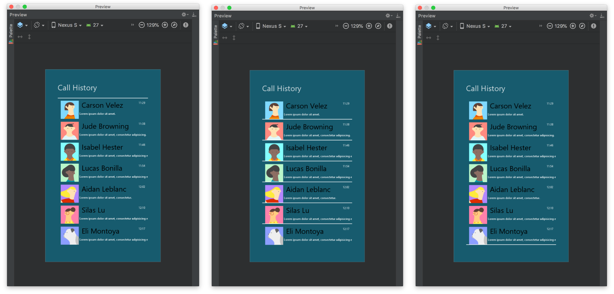

### Gradle Integration

[](https://circleci.com/gh/SodaLabs/styled-views-android)
[  ](https://bintray.com/sodalabs/android/styled-recycler-view/_latestVersion)

Add this into your dependencies block.

```
implementation 'co.sodalabs:styled-recycler-view:x.x.x'
```

If you cannot find the package on JCenter, add this to your gradle repository

```
maven {
    url 'https://dl.bintray.com/sodalabs/android'
}
```

### Usage

- The attribute `app:rvDividerDrawable` let you assign the divider drawable in XML. It adds the divider to all the three positions by default.
- The attribute `app:rvDividerMode` let you determine to add the divider at **beginning**, **middle**, or **end**.

<p align="center">
  
</p>

> From left to right is **only beginning**, **only middle**, and **only end** accordingly

XML Sample:

```XML
<co.sodalabs.view.StyledRecyclerView
    ...
    android:orientation="vertical"
    app:rvDividerDrawable="@drawable/row_item_divider"
    app:rvDividerMode="beginning|middle|end"
    tools:itemCount="7"
    tools:listitem="@layout/recycler_view_item" />
```


